# slack-gcal-sync
Synchronise events from Google Calendar to user profile in Slack


[](https://codecov.io/github/Tomasz-Kluczkowski/slack-gcal-sync)

This project is my test ground for learning Rust language.
The goal is as follows:
- get google calendar events on a predetermined interval
- using configuration mapping google calendar event title to slack user profile settings set the new value for slack user profile

# Project Setup

Assuming linux Ubuntu as OS or WSL2 with Ubuntu.

- clone the repo to your local machine
- [install rust language](https://www.rust-lang.org/tools/install)
- open terminal in root of the project
- install pre-commit tool:
```shell
sudo apt update && sudo apt install -y pre-commit
```
- install pre-commit hook for the project:
```shell
pre-commit install
```
- run tests for entire project:
```shell
 cargo test --workspace
```
- build entire project (in debug, unoptimised mode), check `target/debug`:
```shell
cargo build --workspace
```
- build entire project (optimised for production), check `target/release`:
```shell
cargo build --release --workspace
```

# Application Configuration

You can provide configuration values through application configuration file or purely through command line arguments.
When using configuration file, all fields are required.
Command line arguments are optional or have defaults.
Final configuration is created from a merge of those values.

## Command line interface

- Run `slack-gcal-sync --help` to see command line interface options.

```shell
Usage: slack-gcal-sync [OPTIONS]

Options:
  -c, --calendar-id <CALENDAR_ID>
          The id of the calendar to synchronize. Usually your gmail email account.
  -s, --service-account-key-path <SERVICE_ACCOUNT_KEY_PATH>
          Path to the service account key json file from Google Cloud Project.
  -t, --slack-user-oauth-token-path <SLACK_USER_OAUTH_TOKEN_PATH>
          Path to the slack user oauth token json file.
  -a, --application-config-path <APPLICATION_CONFIG_PATH>
          Path to the application configuration file. [default: config/application_config.json]
  -h, --help
          Print help
  -V, --version
          Print version

```


## Environment variables

- setting slack user oauth token is doable via env var `USER_AUTH_TOKEN` and overrides value read from json file specified in `slack-user-oauth-token-path`.

## Configuration order of precedence

The application configuration is created in the following order:
- if `--application-config-path` cli option is specified, we try to load it from a `json` file at that path.
  - the application configuration must specify all values for application configuration, or it will fail to load.
- if `--application-config-path` cli option is **not** specified, a default application path will be used: `config/application_config.json`.
- if there is no application config file (at default or specified path) we will set default app config.
- any CLI options such as `--calendar-id` override what is specified in the final application config.
- environment variable `USER_AUTH_TOKEN` overrides Slack user oauth token read from file specified at `slack-user-oauth-token-path`.

## Application config file

This file holds application configuration in json format.
The whole file is optional, the configuration can be done purely via command line arguments.
If providing a config file, **all fields are required**, but can be overridden via CLI arguments.

Example application config file:
```json
{
  "calendar_id":  "my-calendar@gmail.com",
  "service_account_key_path": ".secrets/.service_account.json",
  "slack_user_oauth_token_path": ".secrets/.slack_user_oauth_token.json",
  "logging_config_path": "config/logging_config.yaml"
}
```

## Application secrets

This section describes secrets required for the application to work.

### Service account key

- Follow instruction in [Setting Up Integration With Google Cloud API](#setting-up-integration-with-google-cloud-api).
- Once you downloaded the service account key, store it in where `service_account_key_path` specifies.

### Slack User Oauth Token

- Follow instruction in [Setting Up Integration With Slack API](#setting-up-integration-with-slack-api).
- Copy the user oauth token presented in Slack UI in `Oauth & Permissions` section.
- Create a json file with a schema as per example below and provide its path in the application configuration.

Example `.slack_user_oauth_token.json` json schema

```json
{
  "user_oauth_token": "<REDACTED>"
}
```


# Setting up integrations required by slack-gcal-sync app

In the following 2 sections you will see how to set up your Slack and Google Cloud Platform to get necessary credentials
and set up access permissions for slack-gcal-sync app to work.

## Setting Up Integration With Slack API

- navigate to Slack API new app page: https://api.slack.com/apps?new_app=1
- Click `Create New App`

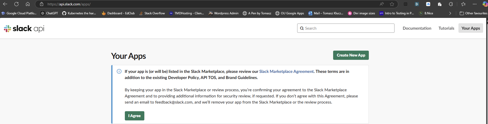

- Click `From a Manifest`

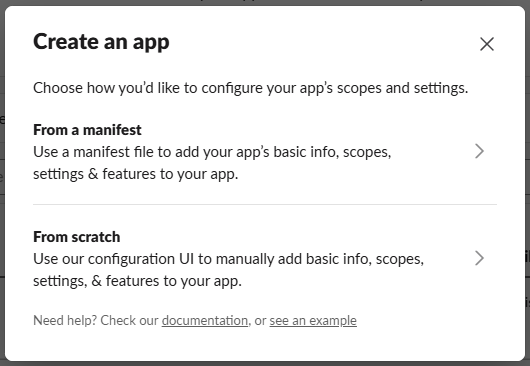

- select target workspace for the new app and click `Next`

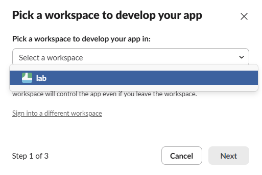

- Paste this manifest in the `Json` tab to allow user profile reading and writing (only) and click `Next`

```json
{
    "display_information": {
        "name": "user-profile-app",
        "description": "User Profile Integration",
        "background_color": "#004492"
    },
    "oauth_config": {
        "scopes": {
            "user": [
                "users.profile:read",
                "users.profile:write"
            ]
        }
    },
    "settings": {
        "org_deploy_enabled": false,
        "socket_mode_enabled": false,
        "token_rotation_enabled": false
    }
}
```

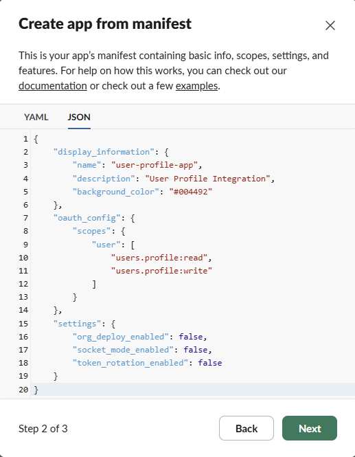


- click `Create`

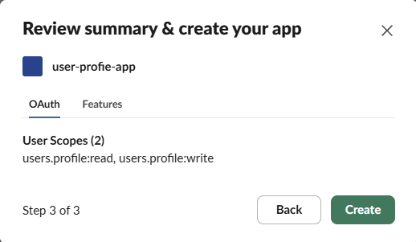

- After your app is created, navigate to `Settings -> Install App` to install it in your workspace and generate necessary `OAuth tokens` for programmatic communication.

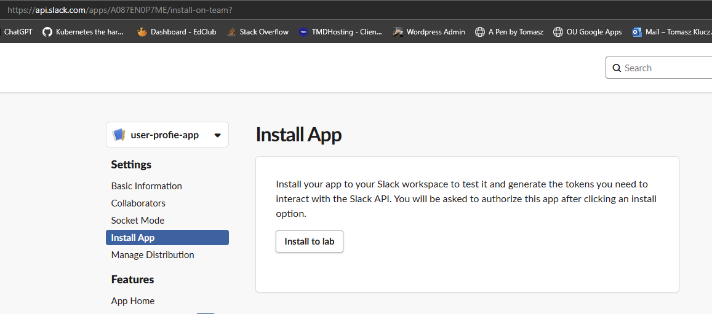

- Click `Install to <your workspace name>` (here my workspace is called `lab` so it shows as `Install to lab`).
- Confirm that you want to install the app and click `Allow`.

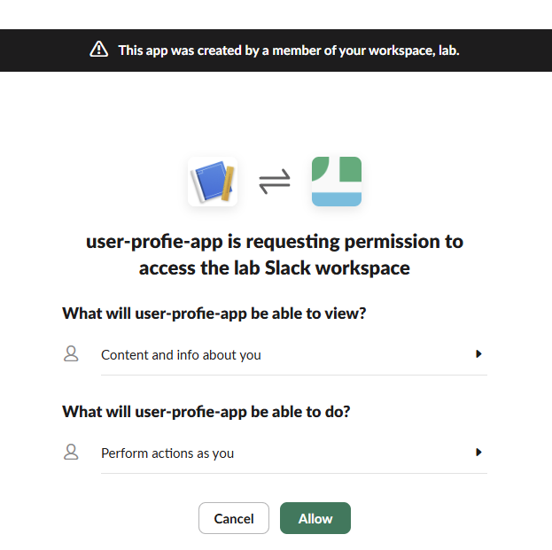

- After you click `Allow` you will be presented with the `User OAuth Token` which will be used for programmatic communication with Slack API on behalf of your user. The secret always starts with `xoxp`.

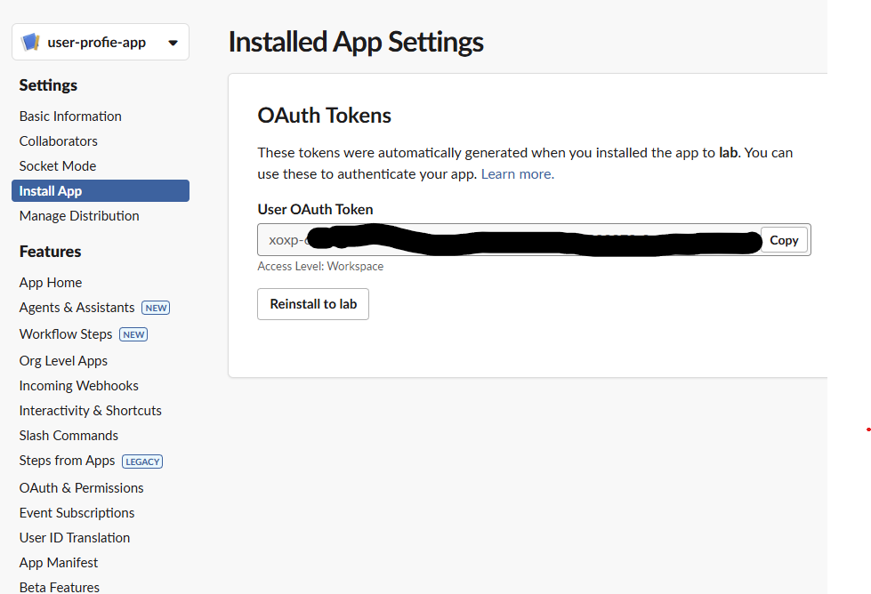

- This can also be found in `Features -> OAuth & Permissions`.

## Setting Up Integration With Google Cloud API

### Create Google Cloud Platform Project

- if you already have google account you can just join google cloud platform, otherwise [create a new google account](https://accounts.google.com/v3/signin/identifier?continue=https%3A%2F%2Fconsole.cloud.google.com%2Fwelcome%2Fnew&hl=en_US&osid=1&service=cloudconsole&flowName=GlifWebSignIn&flowEntry=AddSession&dsh=S-1187740527%3A1735816831106390&ddm=1).
- set up [Google Cloud Account](https://console.cloud.google.com/freetrial/signup/tos) - you can select the free trial.
  - accept Terms of Service and click `AGREE AND CONTINUE`.

    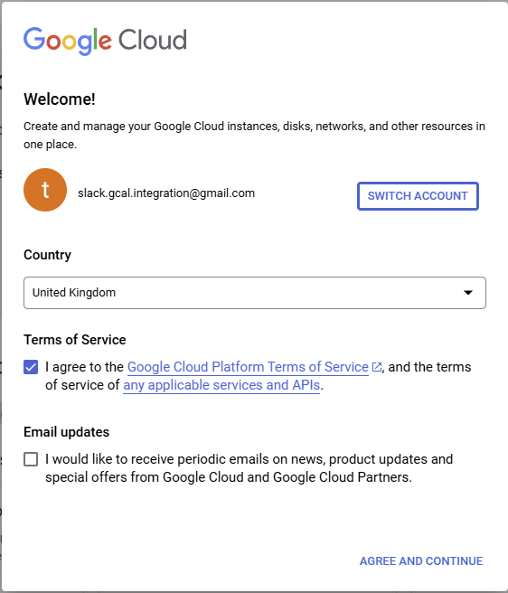

- Click `Select a project` to use existing or create a new one.

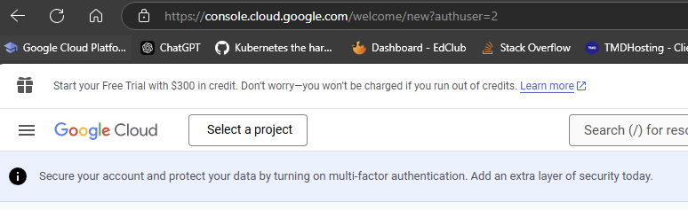

- Click `NEW PROJECT` (we assume starting from scratch here).

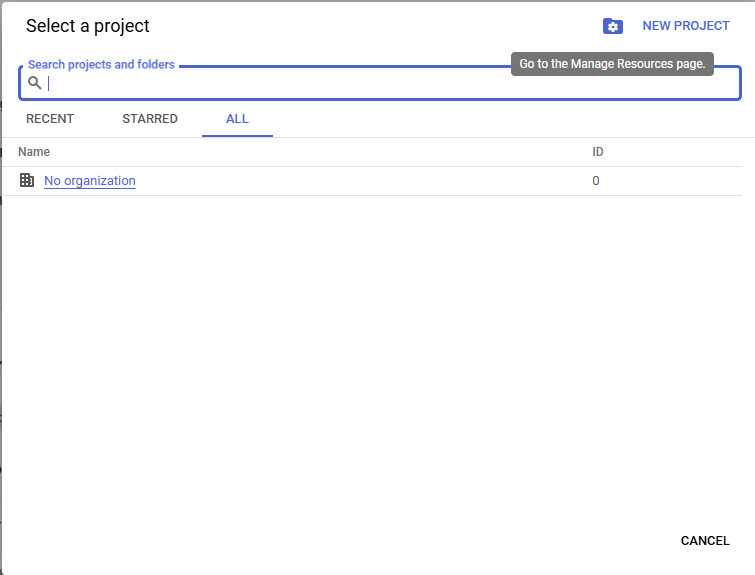

- Give your project a name and click `CREATE`.

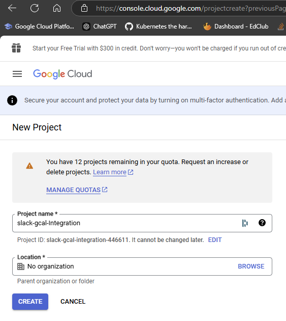

### Enable Google Calendar API

- You will see a notification popup, click `SELECT PROJECT`.

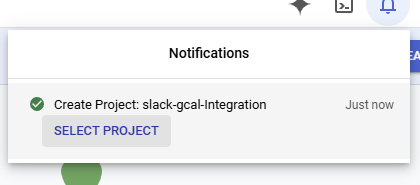

- Click on hamburger navigation menu.

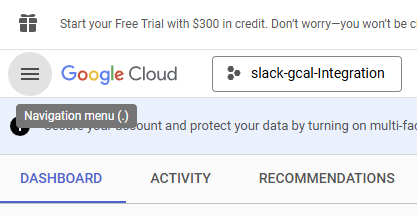

- Click on `APIs & Services` -> `Library` tab.

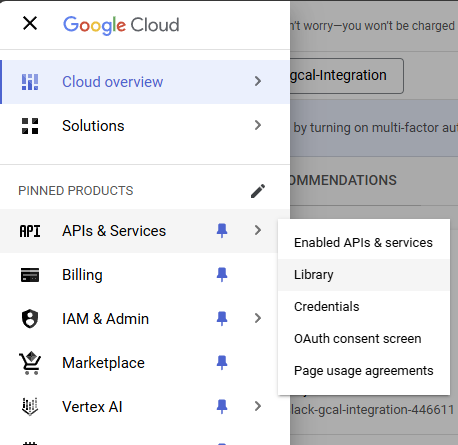

- Scroll down a bit to `Google Workspace` group of apis or just click on it in the sidebar menu and click on `Google Calendar API` box.

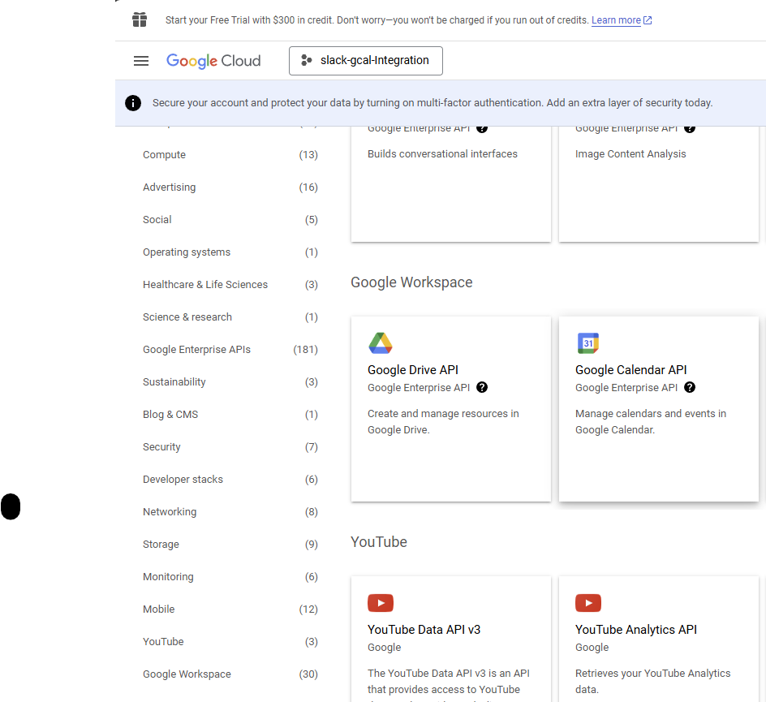

- Click `ENABLE` to switch Google Calendar API in your project.

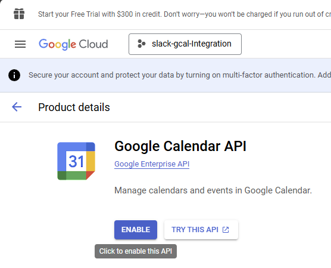


### Create Credentials

- Now we need to create a service account to allow machine to machine communication without need for interactive login.

- In the view that appears after you enabled Google Calendar API, click `Credentials` in the sidebar.

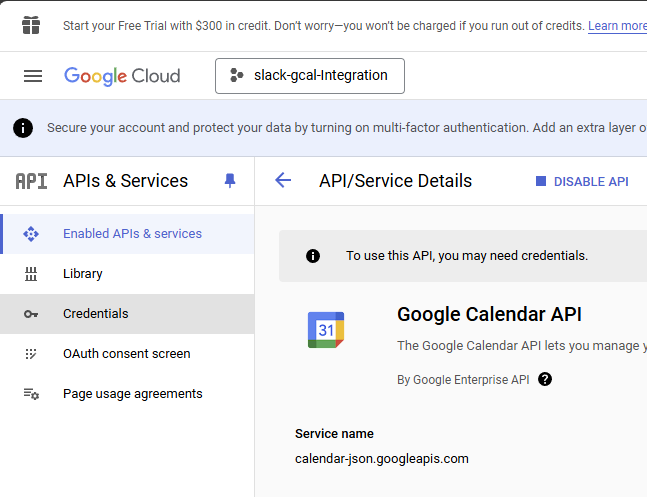

- Click `+ CREATE CREDENTIALS`.

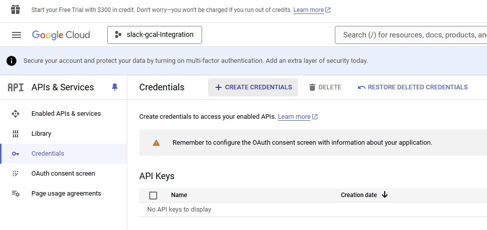

- Click `Service account`.

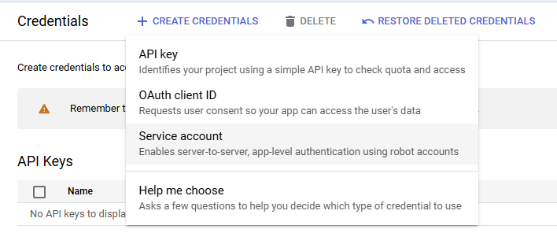

- Fill in `Service account name` and optionally `Service account description` and click `DONE` since we don't need to grant any optional permissions here.

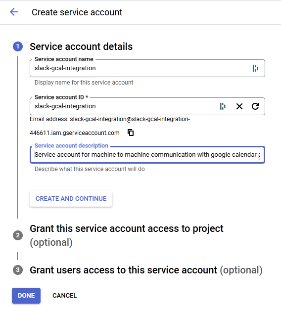

- Click on your newly listed service account to add a service account key.
- Make note of the auto-generated email - we will need it to share Google Calendar with this service account.

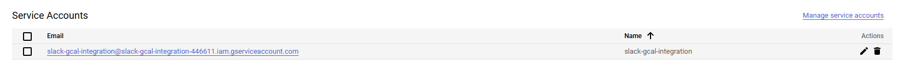

- Click on `KEYS` tab.

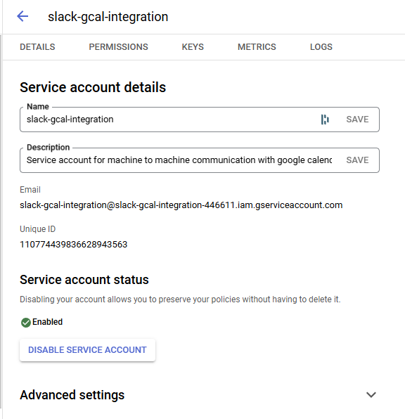

- Click on `Add KEY` -> `Create new key`.

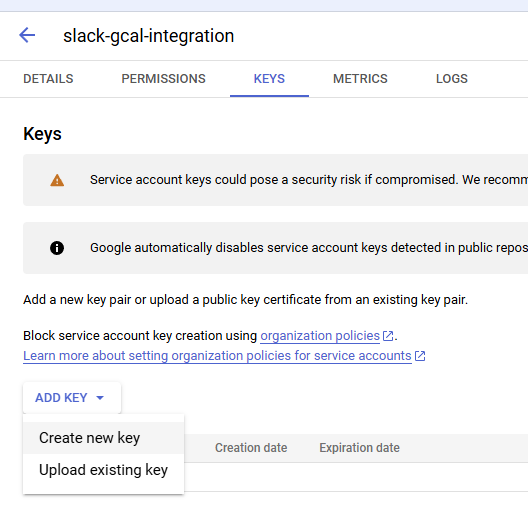

- In the popup use the default `JSON` key type and click `CREATE`.

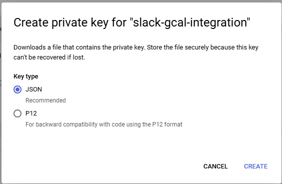

- The private key in json format will be saved in your `downloads` folder on your machine - keep it safe.
- This json file is needed by slack-gcal-sync app to authenticate itself to google calendar api. You will need to
  specify path to it in the app configuration.

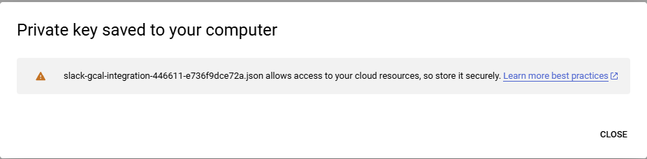

### Share Google Calendar With Service Account

- open [Google Calendar](https://calendar.google.com/calendar/u/0/r) for your Google account
- Click on the cog drop down and `Settings`

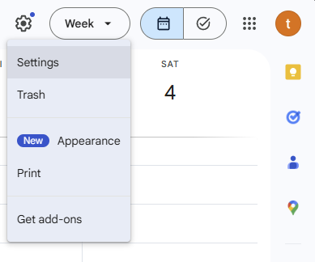

- in `Settings for my calendars` click on the calendar you want to share with the service account

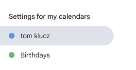

- Scroll down to `Share with specific people or groups` and click `Add people and groups`

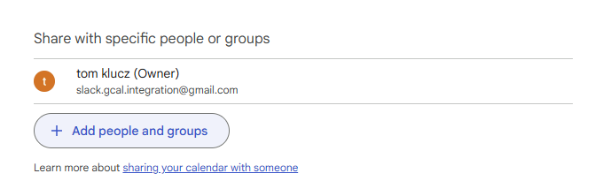

- Fill in the auto-generated email that your service account got from a step above and select appropriate access level. For `read only` use `See all event details`.

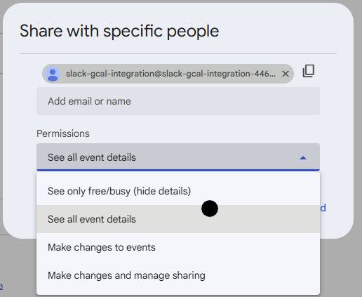

- Click `Send`

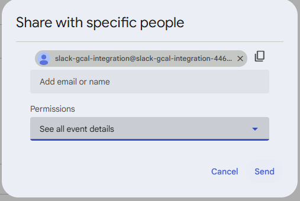

### Get calendar id

- The calendar id is needed when making calls to Google calendar API and needs to be set in the slack-gcal-sync app configuration.
- Simply scroll down on the selected calendar settings page to `Integrate calendar` section and copy `Calendar ID`.

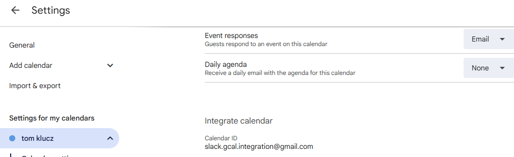


## Debugging tests containing google calendar api calls

To see what mockito server is being called with:
- add `env_logger` to dev dependencies
- set up logger at the beginning of test: `let _ = env_logger::try_init();`
- run test configuration with environment variable set `RUST_LOG=mockito=debug`
- mockito server will nicely show what it was called with like this:

```shell
[2024-12-31T17:42:11Z DEBUG mockito::server] Request received: 
    GET /calendars/test_calendar_id/events?timeMin=2024-12-31T00%3A00%3A00.000Z&timeMax=2025-01-01T00%3A00%3A00.000Z&alt=json
    user-agent: google-api-rust-client/6.0.0
    authorization: Bearer <REDACTED>
    content-length: 0
    host: 127.0.0.1:33285
```